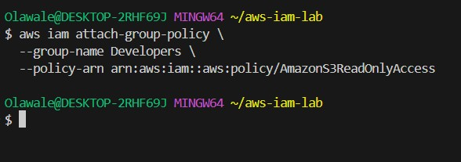
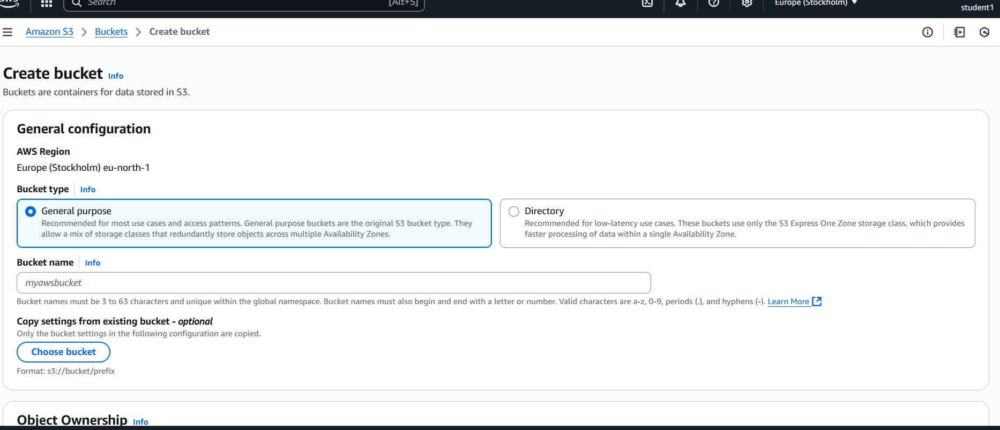
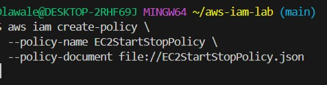
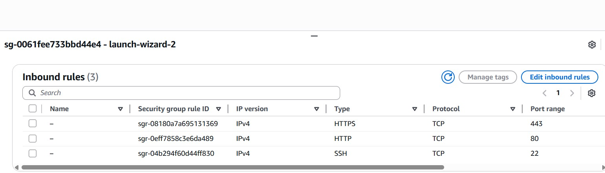

# THIS IS AN ASSIGNMENT TO TEST OUR AWS KNOWLEDGE

# 1. Create Developers Group

  The Script Creates A developer Group

# 2. Attach S3 Access

The Script Attach S3 Access Policy to The  Group

# 3. Create User

The Script Above Creates New User

# 4. Add Users To Developer Group

The Script Above adds users to the developers group

# 5. Check User Access
 
 

 The Screenshot Above Show That Both Students Can Create an S3 Bucket

# 6. Create A Custom Policy

The Script Shows The JSON Policy File That Allows Start And Stop

# 7. Attach Custom Policy To A Student

The ScreenShot Show The Policy has been attached to student 1

#  Assignment 2: EC2 – Launch a Linux Web Server
# ##############################################

# 1. Instance Launch

Launch Instance: Amazon Linux 2, type t2.micro (Free Tier). Create/use a key pair. Network: default
 VPC or your lab VPC.

 # 2. Inbound Rule For SSH HTTP
 

ScreenShot Shows The Inbound Rule That Allows Connection to EC2 through SSH and HTTP

